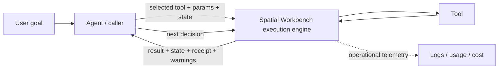
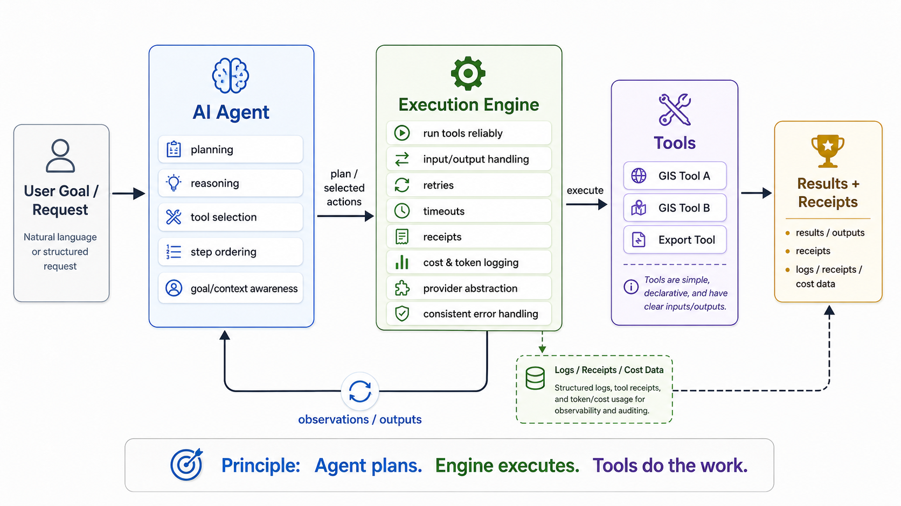

# Spatial Workbench as an Execution Engine

## Purpose

This note captures a reframing for the next work session.

Spatial Workbench started with a simple idea: expose a useful set of spatial tools that capable AI agents, scripts, and humans can call. Recent work on provider normalization, retries, fallback models, usage telemetry, and cost tracking is useful, but it risks making the project look like an AI orchestrator.

That is not the goal.

**Spatial Workbench should be a dependable execution engine for spatial tools.**

The caller, such as GitHub Copilot, Codex, another agent system, a script, or a human-facing client, owns the intelligence around the execution.

> **Agent plans. Engine executes. Tools do the work.**

## Boundary of responsibility

### The agent or caller owns

- understanding the user's goal
- reasoning and planning
- discovering available tools from the published catalog
- selecting which tools to call
- choosing step order
- deciding whether another step is needed
- maintaining workflow/session context across calls
- interpreting outputs and observations
- recovering at the planning level when a different approach is needed

Spatial Workbench should make these jobs easy, but should not duplicate them.

### Spatial Workbench owns

- exposing stable, machine-readable tool contracts
- validating inputs
- running the selected tool
- enforcing workload limits
- managing request-scoped data and artifacts
- handling deterministic runtime failures consistently
- bounded retries and timeouts where appropriate
- returning structured outputs, warnings, errors, and execution receipts
- recording operational telemetry
- providing a consistent execution surface across HTTP, CLI, MCP, and browser clients

The engine can be sophisticated internally while remaining conceptually boring to the caller: **give it a valid tool call and it runs that call reliably.**

### Individual tools own

- a narrow spatial capability
- clear input and output schemas
- domain-specific validation
- the actual spatial or AI-assisted operation
- useful deterministic metadata about what happened

Tools should stay as small and composable as practical.

## The architecture in one picture



The loop belongs to the agent. Spatial Workbench provides a reliable turn of the crank each time around the loop.



## What this means for existing headless work

The existing headless API already points in this direction.

`POST /api/run` is the canonical execution seam. The caller supplies the tool name, parameters, and request-scoped state. Workbench validates the request, runs the tool inside the hosted workload envelope, and returns updated state plus an execution receipt.

The MCP server should remain a **thin transport adapter** over that same runtime. MCP enables agents to discover and call Workbench tools, but Workbench itself does not become the planner.

The browser and CLI are simply other clients of the same underlying execution model.

A useful target shape is:

```text
Codex / Copilot / agent / script / browser
                 |
       discover tool contracts
                 |
            POST /api/run
                 |
        execution engine
        - validation
        - limits
        - isolation
        - retries/timeouts
        - receipts
        - telemetry
                 |
              tools
```

## Where model choice and cost fit

The recent AI provider work is not wasted. It needs a narrower interpretation.

Spatial Workbench contains some tools that use an LLM internally. For those tool executions, the engine should make the provider boundary dependable and observable.

That includes:

- normalized provider responses
- bounded provider retries and timeouts
- consistent error categories
- provider and model metadata
- token usage
- latency
- provider-reported or estimated cost
- optional provider/model fallback for an individual AI-backed operation

This is **execution policy**, not agent orchestration.

The engine should not decide which reasoning model the external agent should use, invent a multi-step plan, or route an entire user goal among models. OpenRouter is useful as the hosted gateway for AI-dependent Workbench operations, but it should not turn Spatial Workbench into a general model router.

A good rule:

> **Model/provider logic belongs in Workbench only when it is necessary to execute a Workbench tool reliably.**

Cost telemetry has the same boundary. It answers questions such as "what did this AI-backed tool execution cost?" It should not become a general agent budgeting system unless that later emerges as a separate product direction.

## Discovery versus selection

There is an important distinction between **publishing tools** and **choosing tools**.

Workbench must publish a catalog with names, descriptions, schemas, constraints, and examples so that agents can discover what is available.

Workbench should not look at a natural-language goal and decide which tool should be called. A capable agent already does that.

Likewise, Workbench may return execution state, but the external caller owns the larger session and decides what state to carry into the next operation.

## Design principles

1. **Caller intelligence, engine reliability.** Do not compete with Codex, Copilot, or other agent runtimes at planning.
2. **One canonical runtime.** HTTP, CLI, MCP, and browser surfaces should converge on the same execution behavior rather than grow separate engines.
3. **Simple tool contracts.** Tools should be declarative, composable, and easy for an agent to understand.
4. **Structured receipts are a product feature.** Every execution should make it obvious what ran, what changed, what was produced, and what warnings occurred.
5. **Request-scoped by default.** Avoid hidden workflow state. Let callers explicitly carry state or dataset handles between operations.
6. **Retries belong close to the failure.** Retry transient infrastructure/provider failures inside the engine. Let the agent decide when the overall plan should change.
7. **Observe without overreaching.** Capture latency, usage, cost, errors, and artifacts without becoming a general agent observability platform.
8. **Spatial first.** The engine exists to make spatial capabilities dependable and agent-callable. General-purpose orchestration is out of scope.

## Next work session

### 1. Audit the current architecture against this boundary

Look at the headless runtime, MCP adapter, AI provider layer, and tool registry and classify each responsibility as one of:

- caller / agent
- execution engine
- tool
- transport adapter

Flag anything where Workbench is beginning to make planning decisions that should remain outside the runtime.

### 2. Make the execution receipt the central contract

Review the current `execution` response and decide what a caller should always be able to learn from one run.

Candidate fields/concepts:

- tool invoked
- success/failure
- start/end or duration
- normalized errors
- warnings
- state changes or output summary
- artifact references
- workload/limit information when relevant
- AI provider/model/token/cost metadata when the selected tool used AI

Do not add fields just because they are available. Prefer a small durable contract.

### 3. Clarify retry ownership

Document and test the split:

- **engine retry:** transient network/provider/runtime failure where repeating the same operation is safe
- **agent retry/replan:** invalid approach, unsuitable tool, changed parameters, alternate tool, or changed workflow

Retries should be bounded and visible in receipts or telemetry.

### 4. Review provider/model configuration through the new lens

Keep the normalized provider client, cost logging, OpenRouter support, and bounded fallback.

Question anything that starts resembling general task-level model routing.

Prefer explicit caller/tool configuration plus sensible runtime defaults over an increasingly clever model-selection subsystem.

### 5. Check transport consistency

Verify that HTTP, CLI, and MCP preserve the same important concepts:

- tool contracts
- request state
- result state
- execution receipt
- warnings/errors
- artifacts

The MCP layer should not create its own orchestration or state model.

### 6. Choose one concrete implementation improvement

After the audit, make one small change that strengthens the execution-engine identity instead of starting a broad rewrite.

Good candidates include:

- improve the execution receipt
- expose retry-attempt metadata
- make AI usage/cost metadata attributable to a specific execution receipt
- tighten a tool contract
- remove duplicated transport behavior
- add a deterministic execution/replay test

## Explicit non-goals for now

- building another general AI agent
- natural-language planning inside Workbench
- autonomous tool selection
- maintaining a long-lived conversational/session memory system
- competing with Codex, Copilot, Claude Code, or similar agent runtimes
- general-purpose multi-provider LLM orchestration
- a universal AI cost optimizer
- a distributed GIS compute platform

## Decision test for future features

When considering a feature, ask:

> **Does this help an external caller execute spatial tools more reliably, consistently, observably, or safely?**

If yes, it probably belongs in Spatial Workbench.

If it primarily helps decide **what to do next**, it probably belongs in the agent.

## Short version

Spatial Workbench is not trying to become the agent.

It is the dependable spatial runtime the agent can trust.

**Agent plans. Engine executes. Tools do the work.**
